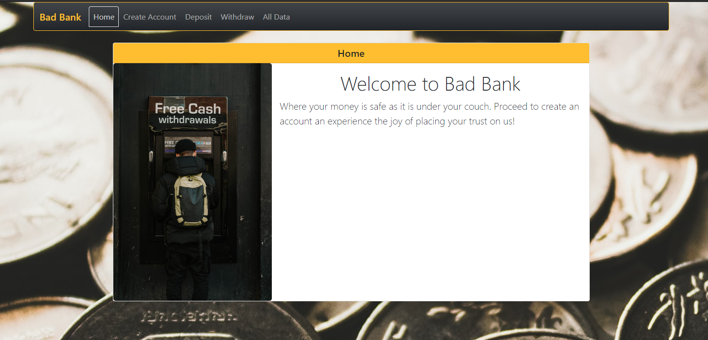

# Bad Bank React App - MIT

# Description

This application is the final project from Module 2 in the MIT X Pro Full Stack Developer Program that focused in the Front-End development using the React library and the Bootstrap framework for styling. In the development of this application I used React hooks, React-Router and context. This app is deployed in a AWS bucket that you can access here: <a href="http://daniel-gaviriabankingapplication.s3-website-us-east-1.amazonaws.com">Bad Bank React Application</a>

To run this application simply clone it into your local machine or download the .zip file to get the source code.

# Author

Daniel Gaviria.

# Improvement Roadmap

1. Implement login functionality.
2. Share state between Deposit and Withdraw pages.
3. Implement Formik library.
3. Implement back-end.
4. Utilize different pictures for each of the pages in the application.

# License

## MIT License

Copyright (c) 2022 Daniel Gaviria

Permission is hereby granted, free of charge, to any person obtaining a copy
of this software and associated documentation files (the "Software"), to deal
in the Software without restriction, including without limitation the rights
to use, copy, modify, merge, publish, distribute, sublicense, and/or sell
copies of the Software, and to permit persons to whom the Software is
furnished to do so, subject to the following conditions:

The above copyright notice and this permission notice shall be included in all
copies or substantial portions of the Software.

THE SOFTWARE IS PROVIDED "AS IS", WITHOUT WARRANTY OF ANY KIND, EXPRESS OR
IMPLIED, INCLUDING BUT NOT LIMITED TO THE WARRANTIES OF MERCHANTABILITY,
FITNESS FOR A PARTICULAR PURPOSE AND NONINFRINGEMENT. IN NO EVENT SHALL THE
AUTHORS OR COPYRIGHT HOLDERS BE LIABLE FOR ANY CLAIM, DAMAGES OR OTHER
LIABILITY, WHETHER IN AN ACTION OF CONTRACT, TORT OR OTHERWISE, ARISING FROM,
OUT OF OR IN CONNECTION WITH THE SOFTWARE OR THE USE OR OTHER DEALINGS IN THE
SOFTWARE.

